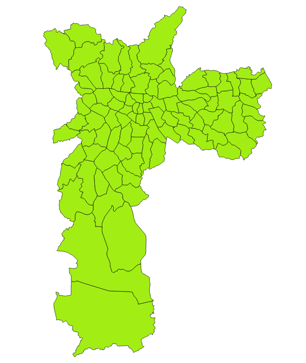

# Distritos da cidade de São Paulo

Fonte: [Secretaria Municipal do Desenvolvimento Urbano](http://www.prefeitura.sp.gov.br/cidade/secretarias/desenvolvimento_urbano/dados_estatisticos/index.php?p=160798)

# Baixar os dados

Escolha um formato:

* [distritos.csv](raw/master/dados/distritos-sp.csv)
* [distritos.geojson](raw/master/dados/distritos-sp.geojson) [(ver mapa)](dados/distritos-sp.geojson)
